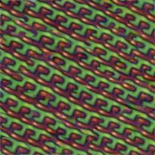
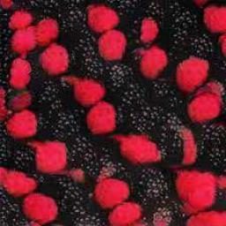
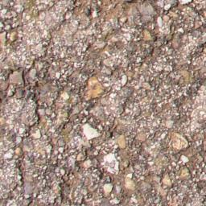
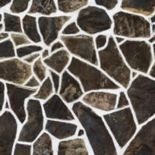
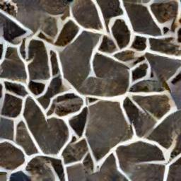
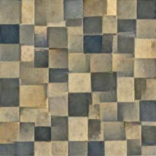

## A Sliced Wasserstein Loss for Neural Texture Synthesis - PyTorch version

This is an unofficial, refactored PyTorch implementation of ["A Sliced Wasserstein Loss for Neural Texture Synthesis" paper](https://github.com/tchambon/A-Sliced-Wasserstein-Loss-for-Neural-Texture-Synthesis) [CVPR 2021].

### Notice:
* The customized VGG-19 architecture might be different from the original Tensorflow implementation. Thus, some results might be inconsistent to the paper. Feel free to give advice.
* The spatial tag part is not included in this implementation.

### Prerequisites
* Python 3.7.10
* PyTorch 1.9.0

### Data
I have collected data in the `data` folder from the official repository and from ["Deep Correlations for Texture Synthesis
"](https://github.com/omrysendik/DCor) [Siggraph 2017].

### Run
First `cd pytorch` and then run some random examples:
```
python texturegen.py --data_folder=SlicedW --img_name=input.jpg
python texturegen.py --data_folder=SlicedW --img_name=2.png
python texturegen.py --data_folder=SlicedW --img_name=berry.png
python texturegen.py --data_folder=SlicedW --img_name=64.png
python texturegen.py --data_folder=DCor --img_name=Texture13.png
python texturegen.py --data_folder=DCor --img_name=Texture32.jpg
python texturegen.py --data_folder=DCor --img_name=Texture19.png
python texturegen.py --data_folder=DCor --img_name=Texture22.png

```
After slightly more than 1 minute for each scene, you can find intermediate outputs in `outputs` folder, and final results in `results` folder.


### Sample Results

Input                      |  Synthesized
:-------------------------:|:-------------------------:
  |  
  |  
  |  
  |  
  |  
  |  
  |  
  |  

### References
* [Official Tensorflow version](https://github.com/tchambon/A-Sliced-Wasserstein-Loss-for-Neural-Texture-Synthesis)